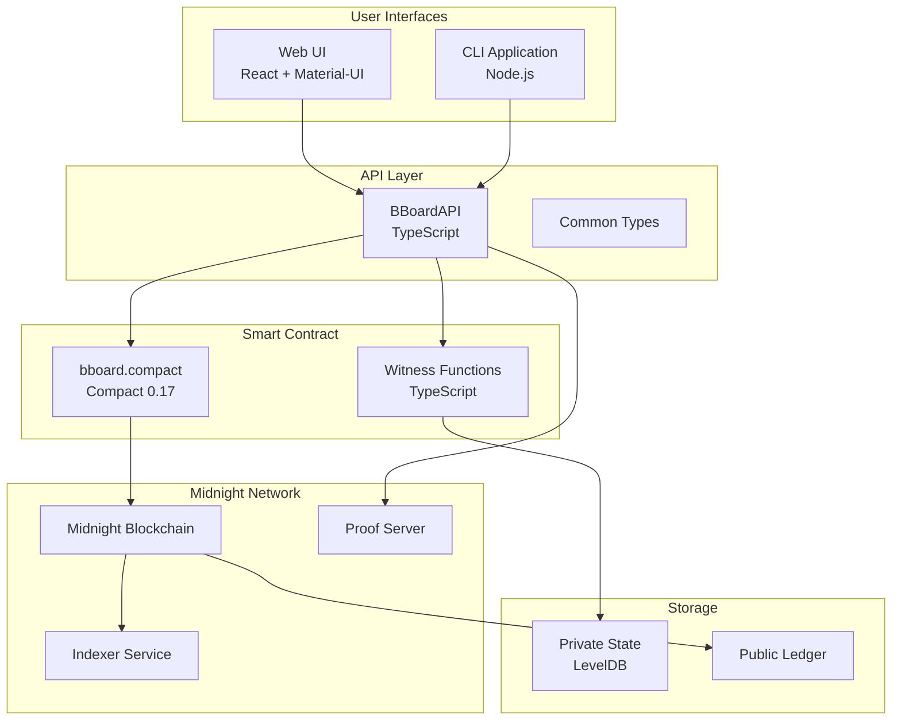

# Midnight Network KYC Attestation DApp - Documentation


## Overview


This project implements a **Know Your Customer (KYC) attestation system** on the Midnight Network blockchain. It's a privacy-preserving DApp that verifies user eligibility based on age and country requirements without revealing the actual personal data on-chain.


### Key Features
- **Privacy-First**: Uses zero-knowledge proofs to verify eligibility without exposing sensitive data
- **Flexible Policies**: Configurable age and country requirements
- **Admin Controls**: Owner-managed(OpenZeppelin library) attestation system with governance capabilities
- **Multi-Interface**: Supports both CLI and web browser interactions
- **Testnet Ready**: Fully integrated with Midnight Network testnet


### Use Cases
- Age verification for regulated services
- Country-based access control
- Compliance with KYC regulations
- Privacy-preserving identity verification
```


### Component Interactions


1. **User Layer**: Web UI or CLI interface for user interactions
2. **API Layer**: Abstracts contract complexity and manages state
3. **Contract Layer**: Compact smart contract with witness functions
4. **Network Layer**: Midnight blockchain and supporting services
5. **Storage Layer**: Private state (local) and public ledger (on-chain)


## Technology Stack


### Core Technologies
- **Blockchain**: Midnight Network (privacy-focused blockchain)
- **Smart Contract Language**: Compact v0.17
- **Runtime**: Node.js v18+ / TypeScript 5.8.3
- **Frontend Framework**: React 19
- **UI Components**: Material-UI v5
- **Build Tool**: Vite 7.0.0
- **Package Manager**: npm (with workspaces)
- **Smart Contract Library**: OpenZeppelin
- **Smart Contract Language**: Compact v0.17
- **Smart Contract Language**: TypeScript


### Key Dependencies
```json
{
 "@midnight-ntwrk/compact-runtime": "^0.8.1",
 "@midnight-ntwrk/midnight-js-contracts": "^2.0.2",
 "@midnight-ntwrk/wallet": "^5.0.0",
 "rxjs": "^7.8.2",
 "fp-ts": "^2.16.10",
 "pino": "^9.7.0"
}
```


## Smart Contract Details


### Contract: `bboard.compact` (KYC)


The KYC attestation contract implements a privacy-preserving identity verification system.


#### Core Data Structures


```compact
struct Attestation {
   epoch: Uint<64>;      // Policy version when issued
   adult: Uint<1>;       // 1 if meets age requirement
   inCountry: Uint<1>;   // 1 if in allowed country
}
```


#### Ledger State


```compact
ledger epoch: Counter;                        // Policy version counter
ledger instance: Counter;                     // Contract instance ID
ledger attest: Map<Bytes<32>, Attestation>;  // User attestations
ledger allowedCountry: Bytes<2>;             // ISO country code
ledger allowedMinAge: Uint<8>;               // Minimum age requirement
```


#### OpenZeppelin Contract Key Functions


##### Admin Functions (Owner Only) (OpenZeppelin)
- `bumpEpoch()`: Increment policy version
- `revokeUpk(uPk)`: Remove user attestation
- `setAdultFlag(uPk, v)`: Manually set adult status
- `setCountryFlag(uPk, v)`: Manually set country status
- `setAllowedMinAge(age)`: Update age requirement
- `setAllowedCountry(country)`: Update country requirement


##### User Functions
- `enrollOnce(ageBytes, country)`: Initial KYC enrollment
- `selfUpgradeToAdult(ageBytes)`: Age-based status upgrade
- `selfRefreshCountry(country)`: Update country status


##### Query Functions
- `checkAdultByUpk(uPk)`: Check if user is adult
- `checkCountryByUpk(uPk)`: Check if user in allowed country
- `checkEligibleByUpk(uPk)`: Check full eligibility
- `checkAdultSelf()`: Self-check adult status
- `checkCountrySelf()`: Self-check country status
- `checkEligibleSelf()`: Self-check eligibility


### Witness Functions


Located in `contract/src/witnesses.ts`, these functions manage private state:


```typescript
export const witnesses = {
 localSecretKey: privateStateKey('localSecretKey')
};
export const ageBytes = {
 localSecretKey: privateStateKey('localSecretKey')
};
export const countryAlpha2 = {
 localSecretKey: privateStateKey('localSecretKey')
};
```


The witness system ensures that sensitive data (secret keys, age, country) never appear on-chain.


## API Layer


The main API class (`api/src/index.ts`) provides:


#### Core Methods
```typescript
class BBoardAPI {
 // Deployment and joining
 static async deploy(providers, logger): Promise<BBoardAPI>
 static async join(providers, contractAddress, logger): Promise<BBoardAPI>
  // State management
 ledgerState$: Observable<BBoardDerivedState>
  // Transaction submission
 async enrollOnce(): Promise<TransactionId>
 async selfUpgradeToAdult(age: number): Promise<TransactionId>
 async selfRefreshCountry(country: string): Promise<TransactionId>
  // Admin functions
 async setAllowedMinAge(age: number): Promise<TransactionId>
 async setAllowedCountry(country: string): Promise<TransactionId>
 async revokeUpk(userPublicKey: Bytes<32>): Promise<TransactionId>
}
```


## User Interfaces
```
Web UI (React)


End-to-end KYC flow:


The user connects their wallet (Lace/SDK). Locally we derive a userSecretKey (never published).


The user uploads their ID (DNI) and minimal form data.


An off-chain Gemini AI service validates the document and extracts fields (date of birth and country). Raw PII never goes on-chain.


The UI normalizes & packs the data:


Country → ISO-3166-1 alpha-2 (e.g., "AR") → Bytes<2>.


Age → completed years (u16) → Bytes<32> (age in the first 2 bytes).


The UI calls the contract: enrollOnce(ageBytes, countryBytes).


On-chain, the contract computes and stores only boolean flags:


adult (age ≥ allowedMinAge, default 21).


inCountry (country == allowedCountry, default "AR").


epoch (policy version).


The contract never stores the user’s actual age or country—only the resulting flags.


The UI shows attestation status and exposes self-service updates:


selfUpgradeToAdult(ageBytes) when the user becomes eligible.


selfRefreshCountry(countryBytes) if their residency changes or policies update.


Purchase & compliance enforcement (tokenized property example):


When the user tries to buy a real-estate token on the tokenization platform, the dApp enforces KYC/Compliance by checking the stored flags:


Front-end pre-gate (fast UX): call checkEligibleSelf() (or checkAdultSelf() + checkCountrySelf()) and only enable the “Buy” action if it returns 1.


On-chain hard gate (recommended): the sale contract validates eligibility before accepting payment (e.g., assert adult == 1 and inCountry == 1 for the buyer’s uPk). This guarantees compliance even if a malicious UI skips checks.


Admins can update policies via Ownable functions:


setAllowedMinAge(age), setAllowedCountry(code), bumpEpoch().


Changing policies triggers new checks (users can call selfRefreshCountry / selfUpgradeToAdult as needed).


What runs where:


Off-chain: ID OCR/validation (Gemini), age/country extraction, packing (u16 → Bytes<32>, "AR" → Bytes<2>).


On-chain: deterministic flag computation & storage (adult, inCountry), read-only checks (check*), and (optionally) purchase gating in the sale contract.
```


## Installation Guide


### Prerequisites
- Node.js v18+ and npm v8+
- Git
- Midnight Lace wallet (for browser UI)
- Access to Midnight testnet
- Compact v0.17


### Step-by-Step Installation


```bash
# 1. Clone repository
git clone https://github.com/joacolinares/kyc-midnight
cd repoMidNight


# 2. Install root dependencies
npm install --legacy-peer-deps


# 3. Build API package
cd api
npm install
npm run build
cd ..


# 4. Build contract
cd contract
npm install
npm run compact  # Compile Compact contract
npm run build     # Build TypeScript
cd ..


# 5. Setup CLI (optional)
cd bboard-cli
npm install
npm run build
cd ..


# 6. Setup Web UI (optional)
cd bboard-ui
npm install
npm run build
cd ..
```


## Security Considerations


### Private Key Management
- Secret keys stored locally via LevelDB
- Never transmitted or stored on-chain
- Derived public keys used for identification


### Zero-Knowledge Proofs
- Age/country verified without revealing values
- Proofs generated locally or via secure server
- Circuit integrity verified on-chain


### Access Control(OpenZeppelin)
- Owner-only admin functions
- Ownable pattern implementation
- Ownership transfer capability


## License


Apache License 2.0


## Acknowledgments


- Midnight Foundation for blockchain infrastructure
- IOG for Compact language development
- Community contributors and testers


## 📋 Table of Contents

1. [Overview](#overview)
2. [Architecture](#architecture)
3. [Technology Stack](#technology-stack)
4. [Project Structure](#project-structure)
5. [Smart Contract Details](#smart-contract-details)
6. [API Layer](#api-layer)
7. [User Interfaces](#user-interfaces)
8. [Installation Guide](#installation-guide)
9. [Development Workflow](#development-workflow)
10. [Testing](#testing)
11. [Deployment](#deployment)
12. [Network Configuration](#network-configuration)
13. [Security Considerations](#security-considerations)
14. [Troubleshooting](#troubleshooting)
15. [Contributing](#contributing)

## Overview

This project implements a **Know Your Customer (KYC) attestation system** on the Midnight Network blockchain. It's a privacy-preserving DApp that verifies user eligibility based on age and country requirements without revealing the actual personal data on-chain.

### Key Features
- **Privacy-First**: Uses zero-knowledge proofs to verify eligibility without exposing sensitive data
- **Flexible Policies**: Configurable age and country requirements
- **Admin Controls**: Owner-managed attestation system with governance capabilities
- **Multi-Interface**: Supports both CLI and web browser interactions
- **Testnet Ready**: Fully integrated with Midnight Network testnet

### Use Cases
- Age verification for regulated services
- Country-based access control
- Compliance with KYC/AML regulations
- Privacy-preserving identity verification

## Architecture



### Component Interactions

1. **User Layer**: Web UI or CLI interface for user interactions
2. **API Layer**: Abstracts contract complexity and manages state
3. **Contract Layer**: Compact smart contract with witness functions
4. **Network Layer**: Midnight blockchain and supporting services
5. **Storage Layer**: Private state (local) and public ledger (on-chain)

## Technology Stack

### Core Technologies
- **Blockchain**: Midnight Network (privacy-focused blockchain)
- **Smart Contract Language**: Compact v0.17
- **Runtime**: Node.js v18+ / TypeScript 5.8.3
- **Frontend Framework**: React 19
- **UI Components**: Material-UI v5
- **Build Tool**: Vite 7.0.0
- **Package Manager**: npm (with workspaces)

### Key Dependencies
```json
{
  "@midnight-ntwrk/compact-runtime": "^0.8.1",
  "@midnight-ntwrk/midnight-js-contracts": "^2.0.2",
  "@midnight-ntwrk/wallet": "^5.0.0",
  "rxjs": "^7.8.2",
  "fp-ts": "^2.16.10",
  "pino": "^9.7.0"
}
```

## Project Structure

```
repoMidNight/
├── 📁 api/                     # Shared API and types
│   ├── src/
│   │   ├── index.ts           # Main API implementation
│   │   └── common-types.ts    # Shared type definitions
│   ├── package.json
│   └── tsconfig.json
│
├── 📁 contract/                # Smart contract
│   ├── src/
│   │   ├── bboard.compact     # Main KYC contract (Compact)
│   │   ├── witnesses.ts       # Witness functions
│   │   ├── index.ts           # Contract exports
│   │   └── managed/           # Compiled artifacts
│   │       └── bboard/
│   │           └── contract/
│   ├── package.json
│   └── tsconfig.json
│
├── 📁 bboard-cli/             # CLI application
│   ├── src/
│   │   ├── index.ts          # CLI entry point
│   │   ├── config.ts         # Network configurations
│   │   └── logger-utils.ts   # Logging utilities
│   ├── package.json
│   └── README.md
│
├── 📁 bboard-ui/              # Web interface
│   ├── src/
│   │   ├── App.tsx           # Main React component
│   │   ├── main.tsx          # Application entry
│   │   ├── components/       # UI components
│   │   ├── contexts/         # React contexts
│   │   └── hooks/            # Custom React hooks
│   ├── package.json
│   └── vite.config.ts
│
├── 📁 .github/                # GitHub templates
│   ├── ISSUE_TEMPLATE/
│   └── PULL_REQUEST_TEMPLATE/
│
├── 📄 package.json            # Root workspace config
├── 📄 WARP.md                 # AI assistant guide
├── 📄 README.md               # Basic readme
├── 📄 CHANGELOG.md            # Version history
├── 📄 CONTRIBUTING.md         # Contribution guidelines
└── 📄 SECURITY.md             # Security policies
```

## Smart Contract Details

### Contract: `bboard.compact`

The KYC attestation contract implements a privacy-preserving identity verification system.

#### Core Data Structures

```compact
struct Attestation {
    epoch: Uint<64>;      // Policy version when issued
    adult: Uint<1>;       // 1 if meets age requirement
    inCountry: Uint<1>;   // 1 if in allowed country
}
```

#### Ledger State

```compact
ledger epoch: Counter;                        // Policy version counter
ledger instance: Counter;                     // Contract instance ID
ledger attest: Map<Bytes<32>, Attestation>;  // User attestations
ledger allowedCountry: Bytes<2>;             // ISO country code
ledger allowedMinAge: Uint<8>;               // Minimum age requirement
```

#### OpenZeppelin Contract Key Functions

##### Admin Functions (Owner Only)
- `bumpEpoch()`: Increment policy version
- `revokeUpk(uPk)`: Remove user attestation
- `setAdultFlag(uPk, v)`: Manually set adult status
- `setCountryFlag(uPk, v)`: Manually set country status
- `setAllowedMinAge(age)`: Update age requirement
- `setAllowedCountry(country)`: Update country requirement

##### User Functions
- `enrollOnce(ageBytes, country)`: Initial KYC enrollment
- `selfUpgradeToAdult(ageBytes)`: Age-based status upgrade
- `selfRefreshCountry(country)`: Update country status

##### Query Functions
- `checkAdultByUpk(uPk)`: Check if user is adult
- `checkCountryByUpk(uPk)`: Check if user in allowed country
- `checkEligibleByUpk(uPk)`: Check full eligibility
- `checkAdultSelf()`: Self-check adult status
- `checkCountrySelf()`: Self-check country status
- `checkEligibleSelf()`: Self-check eligibility

### Witness Functions

Located in `contract/src/witnesses.ts`, these functions manage private state:

```typescript
export const witnesses = {
  localSecretKey: privateStateKey('localSecretKey')
};
```

The witness system ensures that sensitive data (secret keys, age, country) never appear on-chain.

## API Layer

### BBoardAPI Class

The main API class (`api/src/index.ts`) provides:

#### Core Methods
```typescript
class BBoardAPI {
  // Deployment and joining
  static async deploy(providers, logger): Promise<BBoardAPI>
  static async join(providers, contractAddress, logger): Promise<BBoardAPI>
  
  // State management
  ledgerState$: Observable<BBoardDerivedState>
  
  // Transaction submission
  async enrollOnce(age: number, country: string): Promise<TransactionId>
  async selfUpgradeToAdult(age: number): Promise<TransactionId>
  async selfRefreshCountry(country: string): Promise<TransactionId>
  
  // Admin functions
  async setAllowedMinAge(age: number): Promise<TransactionId>
  async setAllowedCountry(country: string): Promise<TransactionId>
  async revokeUpk(userPublicKey: Bytes<32>): Promise<TransactionId>
}
```

#### Provider Architecture

The system requires multiple providers:

```typescript
interface BBoardProviders {
  privateStateProvider: PrivateStateProvider;    // Local state
  zkConfigProvider: ZkConfigProvider;            // ZK circuits
  proofProvider: ProofProvider;                  // Proof generation
  publicDataProvider: PublicDataProvider;        // Blockchain queries
  walletProvider: WalletProvider;                // Transaction signing
  midnightProvider: MidnightProvider;            // Network submission
}
```

## User Interfaces

### Web UI (React)

The browser interface provides:
- Contract deployment wizard
- User enrollment form
- Attestation status viewer
- Admin control panel
- Wallet integration (Midnight Lace)

Key Components:
- `App.tsx`: Main application component
- `Board.tsx`: Contract interaction board
- `DeployedBoardProvider`: Context for contract state
- `BrowserDeployedBoardManager`: Wallet integration

### CLI Application

Interactive command-line interface offering:
- Contract deployment/joining
- Message posting/removal
- State inspection (ledger, private, derived)
- Network configuration options

Menu Options:
```
1. Deploy a new bulletin board contract
2. Join an existing bulletin board contract
3. Post a message
4. Take down your message
5. Display current states
6. Exit
```

## Installation Guide

### Prerequisites
- Node.js v18+ and npm v8+
- Git
- Midnight Lace wallet (for browser UI)
- Access to Midnight testnet

### Step-by-Step Installation

```bash
# 1. Clone repository
git clone https://github.com/your-repo/repoMidNight.git
cd repoMidNight

# 2. Install root dependencies
npm install --legacy-peer-deps

# 3. Build API package
cd api
npm install
npm run build
cd ..

# 4. Build contract
cd contract
npm install
npm run compact  # Compile Compact contract
npm run build     # Build TypeScript
cd ..

# 5. Setup CLI (optional)
cd bboard-cli
npm install
npm run build
cd ..

# 6. Setup Web UI (optional)
cd bboard-ui
npm install
npm run build
cd ..
```

## Development Workflow

### 1. Contract Development

```bash
cd contract

# Edit contract
vim src/bboard.compact

# Compile contract
npm run compact

# Run tests
npm run test

# Build TypeScript
npm run build
```

### 2. API Development

```bash
cd api

# Edit API
vim src/index.ts

# Build
npm run build

# Type check
npm run typecheck

# Lint
npm run lint
```

### 3. UI Development

```bash
cd bboard-ui

# Start dev server with hot reload
npm run dev

# Build for production
npm run build

# Start production server
npm run build:start
```

### 4. CLI Development

```bash
cd bboard-cli

# Build CLI
npm run build

# Run against testnet
npm run testnet-remote

# Run locally
npm run testnet-local
```

## Testing

### Contract Tests

```bash
cd contract
npm run test
```

Tests use Vitest framework and cover:
- Enrollment scenarios
- Policy updates
- Attestation queries
- Access control

### Integration Tests

```bash
# Run full stack test
cd bboard-cli
npm run test:integration
```

### Manual Testing

1. Deploy contract via CLI
2. Set policies (age, country)
3. Enroll test user
4. Verify attestation
5. Test admin functions

## Deployment

### Testnet Deployment

```bash
cd bboard-cli

# Configure testnet
export MIDNIGHT_NETWORK=testnet
export PROOF_SERVER_URL=https://proof.testnet.midnight.network

# Deploy contract
npm run testnet-remote
# Select "1" to deploy new contract
# Note the contract address
```

### Production Deployment

1. Update network configuration in `config.ts`
2. Set production proof server URL
3. Deploy via secure environment
4. Transfer ownership to multisig/DAO

### Docker Deployment

```bash
# Build Docker image
docker build -t midnight-kyc .

# Run container
docker run -p 3000:3000 midnight-kyc
```

## Network Configuration

### Available Networks

#### Testnet Remote
```typescript
{
  indexer: "https://indexer.testnet.midnight.network",
  proofServer: "https://proof.testnet.midnight.network",
  node: "wss://node.testnet.midnight.network"
}
```

#### Testnet Local
```typescript
{
  indexer: "http://localhost:8080",
  proofServer: "http://localhost:3000",
  node: "ws://localhost:9944"
}
```

#### Standalone (Docker)
```typescript
{
  indexer: "http://localhost:8080",
  proofServer: "http://localhost:3000",
  node: "ws://localhost:9944"
}
```

### Configuration Files

- `bboard-cli/src/config.ts`: Network endpoints
- `bboard-ui/src/globals.ts`: Browser configuration
- `.env`: Environment variables (create from `.env.example`)

## Security Considerations

### Private Key Management
- Secret keys stored locally via LevelDB
- Never transmitted or stored on-chain
- Derived public keys used for identification

### Zero-Knowledge Proofs
- Age/country verified without revealing values
- Proofs generated locally or via secure server
- Circuit integrity verified on-chain

### Access Control
- Owner-only admin functions
- Ownable pattern implementation
- Ownership transfer capability

### Best Practices
1. Never share private keys
2. Verify contract addresses
3. Use hardware wallets in production
4. Audit policy changes
5. Monitor attestation updates

## Troubleshooting

### Common Issues

#### 1. Installation Errors
```bash
# Use legacy peer deps flag
npm install --legacy-peer-deps
```

#### 2. WebSocket Errors
```javascript
// Add WebSocket polyfill
globalThis.WebSocket = WebSocket;
```

#### 3. Compilation Errors
```bash
# Clean and rebuild
rm -rf node_modules package-lock.json
npm install --legacy-peer-deps
npm run clean && npm run build
```

#### 4. Network Connection
- Check firewall settings
- Verify network URLs
- Ensure wallet is connected

#### 5. Transaction Failures
- Check wallet balance
- Verify gas fees
- Review transaction logs

### Debug Mode

```bash
# Enable debug logging
export DEBUG=midnight:*
npm run dev
```

### Support Resources
- [Midnight Documentation](https://docs.midnight.network)
- [GitHub Issues](https://github.com/your-repo/issues)
- [Discord Community](https://discord.gg/midnight)

## Contributing

### Development Process

1. Fork the repository
2. Create feature branch (`git checkout -b feature/amazing`)
3. Commit changes (`git commit -m 'Add feature'`)
4. Push branch (`git push origin feature/amazing`)
5. Open Pull Request

### Code Standards

- TypeScript strict mode enabled
- ESLint + Prettier formatting
- 100% test coverage for contracts
- Documentation for public APIs

### Commit Convention

```
type(scope): description

[optional body]

[optional footer]
```

Types: `feat`, `fix`, `docs`, `style`, `refactor`, `test`, `chore`

### Review Process

1. Automated CI/CD checks
2. Code review by maintainers
3. Security audit for contract changes
4. Documentation updates required

## License

MIT License - See [LICENSE](LICENSE) file for details

## Acknowledgments

- Midnight Foundation for blockchain infrastructure
- IOG for Compact language development
- Community contributors and testers

---

📝 **Note**: This documentation reflects the current state of the project. For the latest updates, check the [CHANGELOG](CHANGELOG.md) and [GitHub releases](https://github.com/your-repo/releases).
